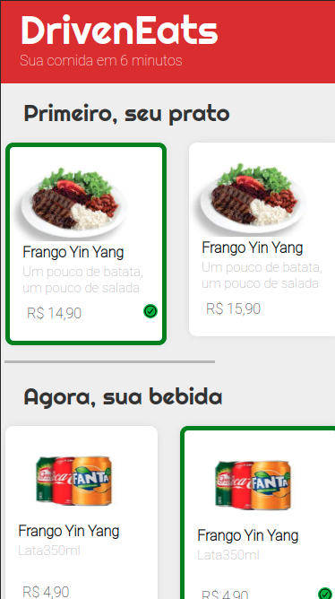

### DrivenEats

Primeiro projeto usando JavaScript é a implementação do site mobile do DrivenEats, um restaurante especial que entrega seu pedido em 6 minutos.
Para isso, o restaurante só trabalha com um tipo específico de pedido: o combo de Prato+Bebida+Sobremesa.
O site permite de forma fácil a escolha do seu combo, enviando em seguida o pedido por WhatsApp diretamente para o restaurante.

Projeto feito em 08/2022

link da vercel https://driven-eats-topaz.vercel.app/

# Como instalar 
Bastar clonar esse repositório e rodar na sua máquina
